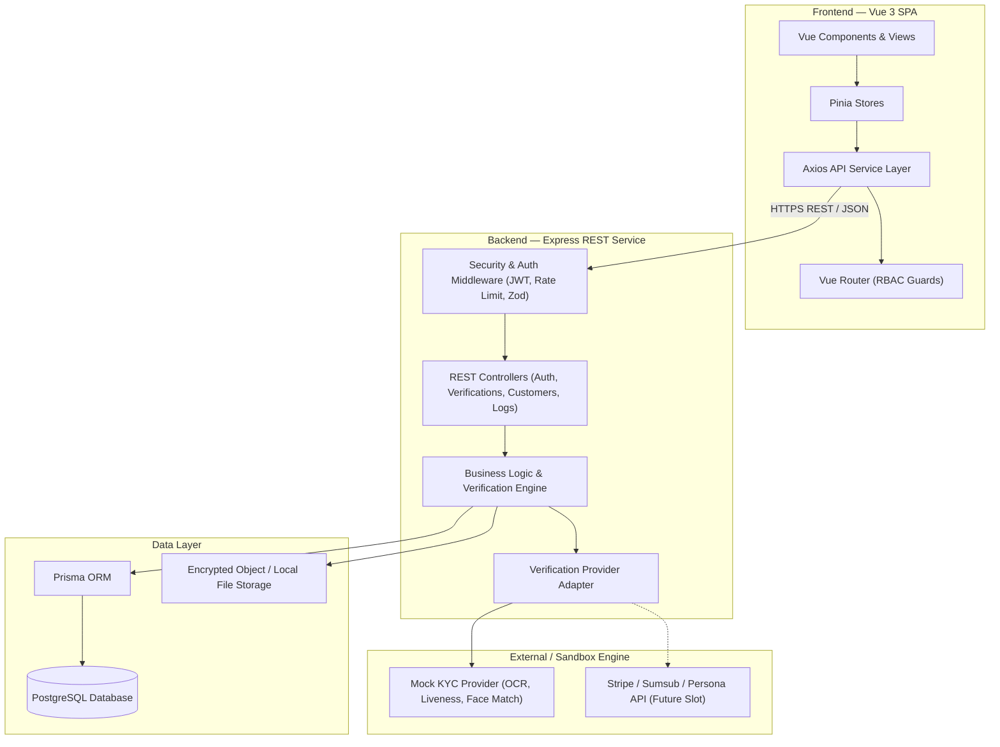
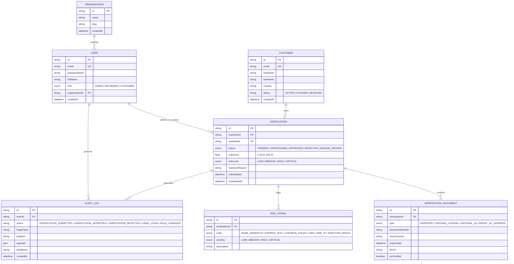
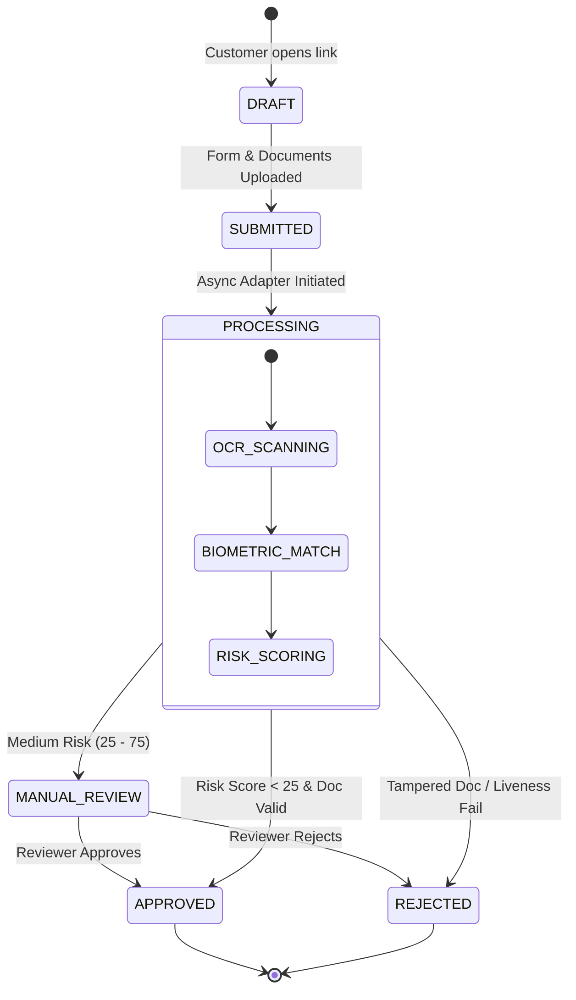
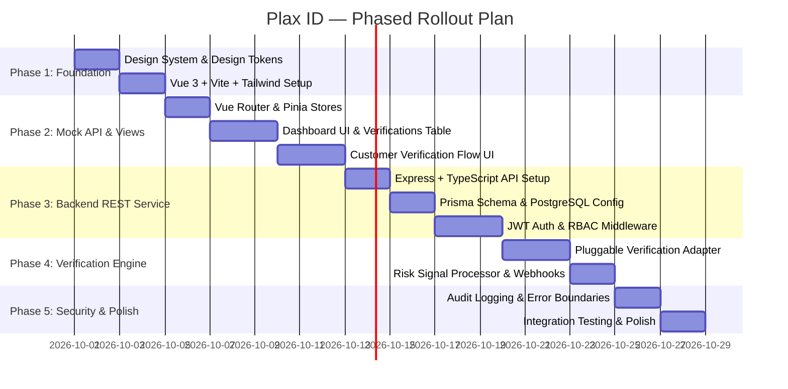

# Plax ID — Digital Identity Verification Platform
## System Design & Architecture Specification

---

## 1. Executive Summary & Core Concept

**Plax ID** (formerly *TrustVerify*) is an enterprise-grade Digital Identity Verification & KYC Compliance platform. It enables businesses to integrate automated document verification, facial selfie matching, and risk analysis into customer onboarding workflows while giving compliance teams a centralized dashboard for real-time monitoring, audit logging, and manual decisioning.

### Key Objectives
* **Demonstrate Enterprise Architecture**: Modern frontend (Vue 3, Pinia, TypeScript, Vue Router, Tailwind CSS) paired with a clean REST backend (Node.js, Express, TypeScript, Prisma ORM, PostgreSQL).
* **Pluggable Verification Engine**: Sandbox provider adapter with simulated OCR/biometric verification delays, realistic edge cases (liveness fail, expired ID, mismatched names), and clear integration hooks for live APIs (Stripe Identity, Sumsub, Persona).
* **Strict Security & Compliance**: Role-Based Access Control (RBAC), JWT authentication, request rate limiting, input validation via Zod, and immutable audit logs.

---

## 2. System Architecture



---

## 3. Database Schema Design (Prisma / PostgreSQL)



---

## 4. Role-Based Access Control (RBAC) Matrix

| Feature / Resource | Admin | Reviewer | Customer |
| :--- | :---: | :---: | :---: |
| **Start Verification Workflow** | ❌ | ❌ | ✅ |
| **Upload ID Documents & Selfie** | ❌ | ❌ | ✅ |
| **View Own Verification Status** | ❌ | ❌ | ✅ |
| **View Company Dashboard & Analytics** | ✅ | ✅ | ❌ |
| **List & Filter All Verifications** | ✅ | ✅ | ❌ |
| **Review Document Details & Risk Signals** | ✅ | ✅ | ❌ |
| **Approve / Reject Verification** | ✅ | ✅ | ❌ |
| **View Audit Logs** | ✅ | ❌ | ❌ |
| **Manage Team & Assign Roles** | ✅ | ❌ | ❌ |
| **Configure Provider & Risk Rules** | ✅ | ❌ | ❌ |

---

## 5. Verification State Machine



---

## 6. Frontend Architecture (Vue 3 + TypeScript)

### Directory Structure Blueprint

```
src/
├── assets/                  # Styling, icons, typography tokens
│   ├── main.css             # Dark theme design system tokens & glassmorphism
│   └── fonts/
├── components/              # Atomic UI components
│   ├── common/              # Base Button, Input, Modal, Badge, Card, Spinner
│   ├── dashboard/           # MetricsCard, ActivityChart, VerificationsTable
│   ├── verification/        # DocUploader, SelfieCapture, StepIndicator
│   └── layout/              # Sidebar, Topbar, AuthLayout, DashboardLayout
├── composables/             # Reusable composition functions
│   ├── useAuth.ts           # Authentication logic & current user state
│   ├── useVerifications.ts  # Verification query & action hooks
│   └── useNotification.ts  # Toast & alert manager
├── router/                  # Vue Router configuration
│   ├── index.ts             # Route definitions
│   └── guards.ts            # Authentication & RBAC guard logic
├── services/                # API client abstraction
│   ├── api.ts               # Axios instance with interceptors
│   ├── authService.ts       # Auth endpoints
│   ├── verificationService.ts
│   └── customerService.ts
├── stores/                  # Pinia state stores
│   ├── authStore.ts         # User session & permissions
│   ├── verificationStore.ts # Dashboard data, filters, active item
│   └── customerStore.ts     # Customer records
├── types/                   # TypeScript interfaces & Enums
│   ├── auth.ts
│   ├── verification.ts
│   └── api.ts
├── views/                   # Main page components
│   ├── auth/                # Login, Register, ForgotPassword
│   ├── dashboard/           # Overview, Verifications, Customers, RiskSignals, AuditLogs
│   ├── verification/        # Customer onboarding flow steps
│   └── settings/            # Profile, Team, Security
├── App.vue                  # Root component
└── main.ts                  # App entry point
```

---

## 7. REST API Endpoint Specification

### Authentication
* `POST /api/auth/register` — Register a new account
* `POST /api/auth/login` — Authenticate and receive JWT access/refresh tokens
* `POST /api/auth/logout` — Invalidate current session
* `GET  /api/auth/me` — Retrieve logged-in user profile & role

### Verifications Workflow
* `GET   /api/verifications` — List verifications (supports `status`, `riskLevel`, `search`, `page`, `limit`)
* `POST  /api/verifications` — Customer starts & submits a new verification
* `GET   /api/verifications/:id` — Get detailed verification file, documents, & risk signals
* `PATCH /api/verifications/:id/decision` — Reviewer/Admin approves or rejects verification

### Dashboard Analytics & Stats
* `GET /api/dashboard/stats` — Metrics overview (Total, Approved, Pending, Failed, Avg Risk Score)
* `GET /api/dashboard/activity` — Timeline chart data for verifications over time

### Audit Logs & Team Management
* `GET  /api/audit-logs` — Fetch audit trail (Admin only)
* `GET  /api/team` — List organization team members (Admin only)
* `POST /api/team/invite` — Invite new team member with assigned role (Admin only)

---

## 8. Implementation Roadmap (Phased Development Plan)



---

## 9. Next Immediate Steps

1. **Setup Monorepo / Directory Structure** for `plax` (Frontend `client` and Backend `server`).
2. **Install Core Dependencies**:
   * Frontend: Pinia, Vue Router, Axios, Lucide Vue icons / Heroicons, Tailwind CSS.
   * Backend: Express, TypeScript, Prisma, jsonwebtoken, bcrypt, Zod, cors, dotenv.
3. **Build Frontend Design System**: Dark theme palette, glassmorphic cards, custom status pills, and responsive layout.
